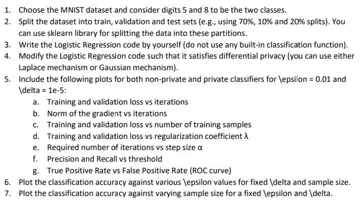

# ML-with-DifferentialPrivacy
Implementation of Differentially Private Logistic Regression with L2 Regularization.

This repo also explores relation among Epochs, Sample size, Regularization parameter(lambda), Norm of Gradeints etc.

